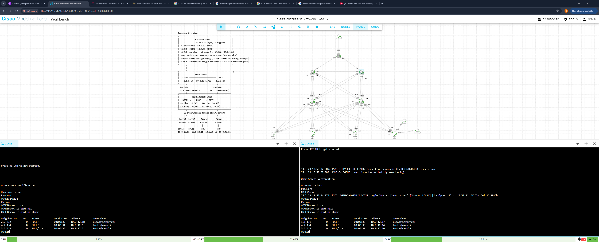
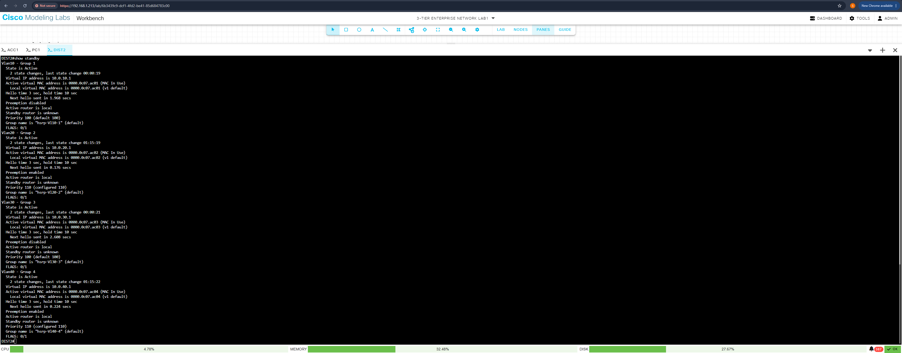
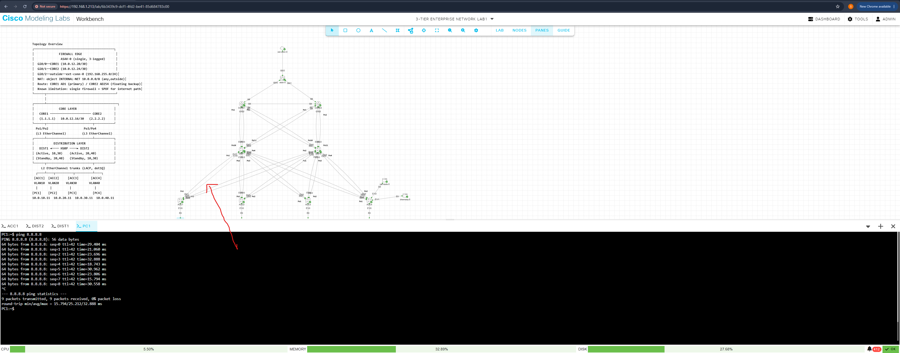
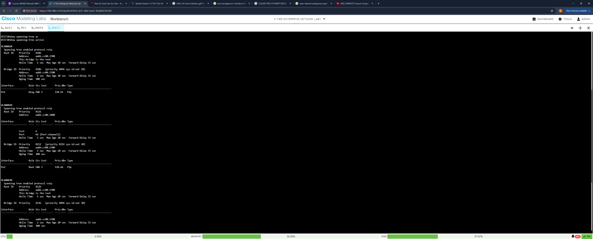
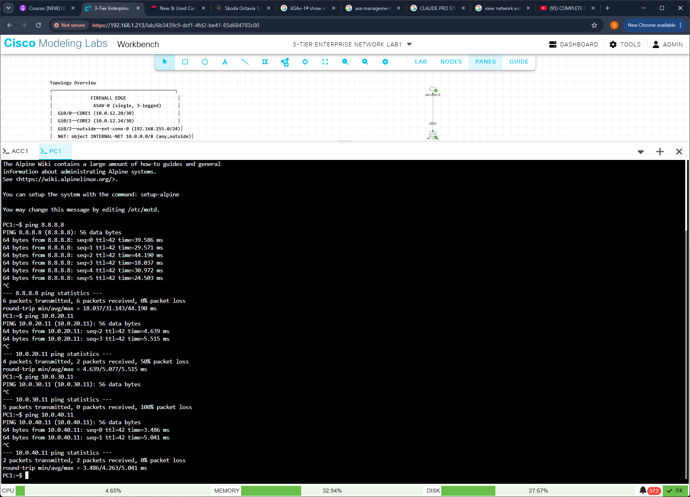

# CML 3-Tier Enterprise Network Lab + Firewall Edge

A 3-tier enterprise network (Core / Distribution / Access) built in Cisco Modeling Labs (CML), later extended with an iteratively-designed single-firewall internet edge. Built and documented in two phases — see [`CHANGELOG.md`](./CHANGELOG.md) for the full history.

## Documentation

| Doc | Covers |
|---|---|
| [`docs/3-Tier_Enterprise_Network_Lab_v4.docx`](./docs/3-Tier_Enterprise_Network_Lab_v4.docx) | Base fabric: topology, addressing plan, per-device config checklist, all 10 build phases |
| [`docs/firewall-edge-design.md`](./docs/firewall-edge-design.md) | Firewall edge: all 3 design iterations, final configs, redundancy tradeoffs |
| [`CHANGELOG.md`](./CHANGELOG.md) | Build history across both phases |

## Highlights

- **Core layer:** OSPF area 0, dual routers fully cross-connected to both distribution switches via L3 LACP EtherChannel
- **Distribution layer:** HSRP first-hop redundancy (active/standby split per VLAN), deterministic STP root placement, VTP-propagated VLANs
- **Access layer:** L2 EtherChannel + 802.1Q trunking, port-security, DHCP snooping, BPDU Guard
- **Security:** named ACL enforcing inter-VLAN management restrictions; DHCP served centrally from CORE1 with per-VLAN pools
- **Internet edge:** single-firewall design (ASAv) sitting between both cores and the internet, with a floating static route for backup path resilience

## Device Access
Import lab/3-tier-enterprise-network-lab.yaml into CML to run this topology yourself.
| [`lab/3-Tier_Enterprise_Network_Lab1.yaml`](./lab/3-Tier_Enterprise_Network_Lab1.yaml) | Full CML lab export — import directly to run the topology |

All devices use local authentication:
- Username: `cisco`
- Password: `cmllab` *(placeholder — change after import)*
- enable secret cisco
- SSH-only on VTY lines, no Telnet

## Design journey

The firewall edge went through three architectures before landing on the current one:

1. **ASA active/standby failover pair** — rejected after discovering failover requires both units on a *shared* L2 segment, not independent point-to-point links
2. **Two independent firewalls** (one per core) — rejected after diagnosing asymmetric routing: two stateful firewalls without shared connection state, fed by OSPF ECMP, silently drop return traffic
3. **Single firewall, three legs** (current) — no shared-state requirement, no ECMP asymmetry risk, at the cost of the firewall itself being a single point of failure — a documented, deliberate tradeoff

Full reasoning, configs, and addressing for all three iterations are in [`docs/firewall-edge-design.md`](./docs/firewall-edge-design.md).

## Validated

## Validated

- OSPF adjacencies FULL on all Core–Distribution links
- HSRP failover tested (DIST1 shutdown → active role moves to DIST2 cleanly)
- EtherChannel member-link removal tested (traffic continues uninterrupted on remaining member)
- STP root bridge confirmed unchanged for all VLANs after HSRP and EtherChannel failure tests
- MGMT-RESTRICT ACL confirmed blocking VLAN 10/20/40 → VLAN 30 on both distribution switches
- End-to-end internet reachability confirmed from all four VLANs through the firewall edge

### Phase 10 evidence

